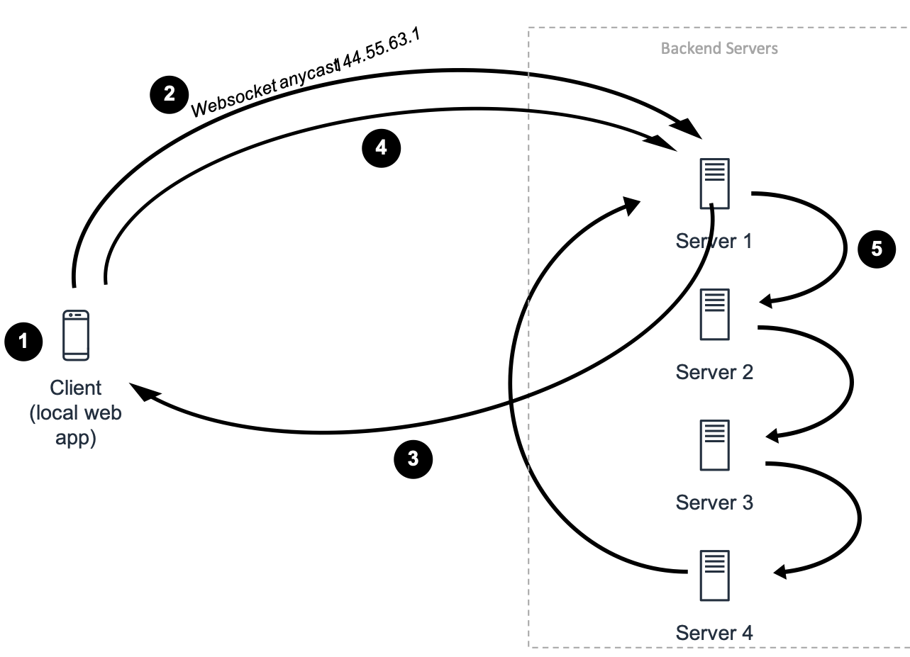

# Local's Hit

### Group 16: David Lüttmann, Frederick Dehner, Markus Drespling

## Problem Statement: 

## Project description:  
Our project is a mobile social media platform, where the user can anonymously share quotes with people. It is best described with “a snapchat for short quotes (like twitter)”. Each uploaded content is initially visible within a certain time period. Our goal is that all users, despite the distance, are close to funny events, interesting finds or other occurrences. With serveral backend servers we provide the shared content to the client and replicate shared quotes. 
In a further step we can think about uploading images instead of text or a vicinity-based service, so that the content is only visible for users in a limited area of approximately 10 kilometers around the person who uploaded the content. But for this we will focus on the technical topics of this lecture. Because these two ideas have a high amount of client-based technology like GUI programming or location-based services. 

# Requirement Analysis 

## Dynamic discovery of hosts
Every backend-server sends a service beacon at least every t=5 seconds over a UDP Datagram multicast (e.g. port 1200). Every server holds a list of the other servers. 
The client (in our case the users device) only communicates with one backend server which is allocated by the leader. The process will be implemented with sockets. 

## Having a voting algorithm:
Basically our product is a list with pictures, so we assume that the link between the process are unidirectional and every process can message to the process on its right only. Therefore we choose the ring algorithm. (Backend receives content from client, replicates the content and shares it with other backends)
With a leader election algorithm we provide that we have at least and at most one leader. This one is the first backend-server, which responds to client requests. 
We choose the LeLann-Chang-Roberts (LCR) algorithm for leader election, because our system meets the requirements for that algorithm. Each participant has a unique ID, we have an asynchronous system with a reliable fifo-ordered multicast network which is coordinated in a clockwise unidirectional ring-based way. 

## Some form of ordered reliable multicast
As soon as a server makes a change to its database, this change must be communicated to the other servers via multicast. We implement reliable multicast (r-multicast) type with fifo and causal ordering (“happened before”). We provide causality order with a vector clock. Total order is not as important, because the messages (quotes) are not depending on one another. It is a stream of quotes, not a text conversation with replies. For example, a database change is a upload of a new picture. It is important that the images on each server have the same order and that each server receives the change.

## Being tolerant to crash faults (omission faults and byzantine faults give a higher mark)
We implement two concepts of a fault-tolerant system. First, we have redundancy in servers, second, we have data replication over all servers. With the usage of the ring topology and data replication, every backend server has the same knowledge, so the data is crash resistant. In case of a backend server crash, the other backend servers will inform each other and try to choose a new leader, if necessary. With these concepts we have a masking fault tolerance, that means that failures are tolerated and handled from the system and are not visible for the user. Data integrity is provided with a quorum-based data replication. With a checksum we can verify that a message is consistent.

## Having an explicit architectural model
Illustration 1 describes our architecture model:
1. Client has stored the website as an app locally
2. Client requests connection to backend server via anycast address. 
3. The leader server will answer to the client.
4. Now the client connects directly via socket to a backend server to get content
5. Backend servers replicates with all other backend servers.

 

Illustration 1: Architecture model